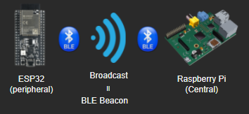
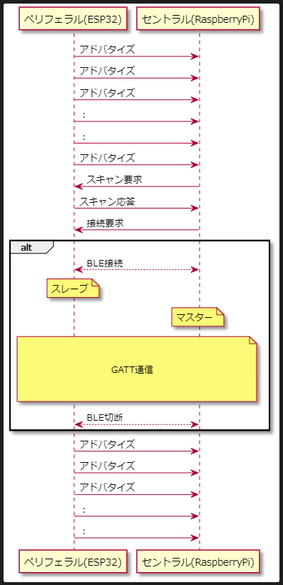

# ESP32からRaspberryPiへのBluetooth(BLE)通信

## 構成


## 前提知識
- BLE通信では、各機器に対して複数の呼び方の定義がある。上図の関係性の場合は、下表のとおりとなる。

||ESP32|RaspberryPi|
|--|---|---|
|親機と子機の関係|Peripheral(ペリフェラル=子機)|Central(セントラル=親機)|
|接続前の呼び方|Advertiser(アドバタイザ)|Scanner(スキャナ)|
|接続後の呼び方|Slave|Master|
|GATTにおける役割|Server|Client|
|ペアリング時の役割|Responder(レスポンダ)|Initiator(イニシエータ)|
|ブロードキャスト通信の役割|Broadcaster|Observer|

- 通信確立までのシーケンスを要約すると、以下のとおり。
  - Peripheral(ESP32)が、アドバタイズ（定期的にAdvertiseパケットを発信）を開始する。
  - Central(RaspberryPi)が、スキャン（bleak.discover）を実行してアドバタイズしているPeripheralを検知する。
  - Centralが、Peripheralへ接続要求を行う。Periphralが応答して接続を確立。
  

### 参考情報
- [ムセンコネクト「サルでもわかるBLE入門」](https://www.musen-connect.co.jp/blog/course/trial-production/ble-beginner-2/)
- [アーズ株式会社「BLE基礎」](https://www.youtube.com/watch?v=0p-7CerKWLA)
- [ハートテクノロジ「BLEの基礎」](https://www.youtube.com/watch?v=fZpwW8-pp_I&t=328s)


## 実行

### 前提環境設定(ESP32)

- [こちらのスケッチ](./ESP32/ble.ino)をダウンロードする
- 特に変更は必要ないが、以下のコード部分が固有情報である。  

```CSharp
// BLE characteristic
#define SERVICE_UUID           "28b0883b-7ec3-4b46-8f64-8559ae036e4e"
#define CHARACTERISTIC_UUID_TX "2049779d-88a9-403a-9c59-c7df79e1dd7c"

// BLE Device name
#define DEVICENAME "ESP32"
```
- 上記コードをArduinoIDEを使用してESP32へ書き込む。

### 前提環境設定(RaspberryPi)
- RaspberryPiのターミナルで、Pythonの「bleak」ライブラリをインストールする
```bash
$ pip install bleak
```
- [こちらのPythonスクリプト](./RaspberryPi/)をダウンロードする
- main.pyの以下の箇所を、接続先ESP32のBLEのMACアドレスに変更する。
```python
TARGET_ADDRESS = "40:91:51:BE:E8:5A"
```
- (変更は不要だが)blehandler.pyの以下の値が、ESP32の「CHARACTERISTIC_UUID_TX」と一致させる必要がある。
```python
ESP32_CHARACTERISTIC_UUID = "2049779d-88a9-403a-9c59-c7df79e1dd7c"
```

### 実行方法
- Raspberry Piで以下のコマンドを実行する
```bash
$ python3 main.py
```

### コード参考
- esp32側：[BLE通信でESP32から取得したセンサ値をRaspberryPiへ送信してみた](https://taku-info.com/bleconnection-esp32andrpi/)
- raspberryPi側：[【体重自動記録ツール】体重計のBLE情報を取得してみる #1](https://buzz-server.com/tech/weight_measurement_ble_001/)