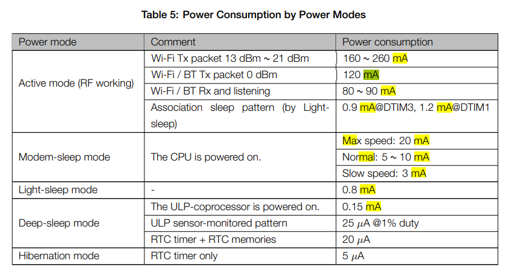
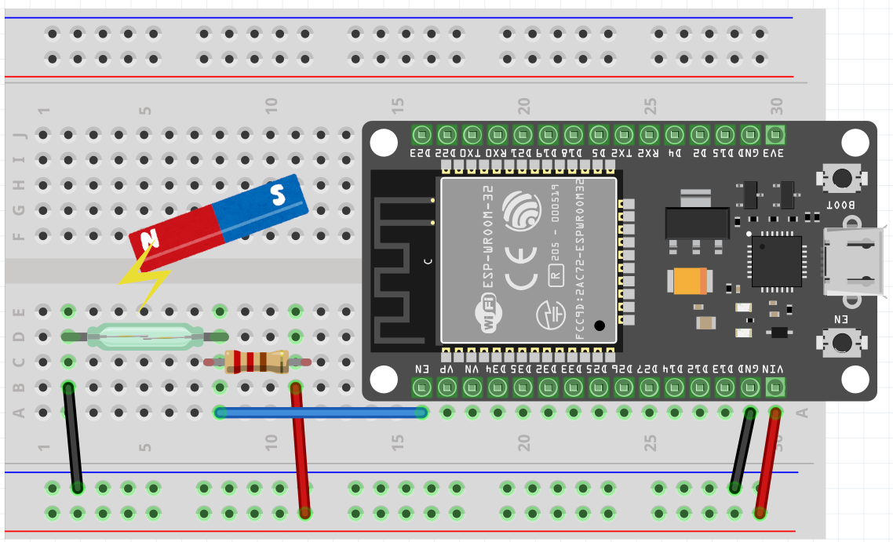

# ESP32のスリープモードについて

## ESP32のスリープモード
ESP32には、消費電力を抑えるための「スリープモード」が、大きく3種類存在します。
- Modem-sleep mode ：CPUの動作を維持したまま、非通信時にWiFi用のRF回路をオフにして電力をおさえる。WiFiとの接続は維持。
- Ligth-sleep mode : 通信が行われないときにはWiFi用のRF回路をオフにし、CPUの実行をサスペンド。GPIOなどの入力情報をトリガーに何かを実行するのに向いている。
- Deep-sleep mode : RTCのみの電源がオンでCPUは停止状態。復旧時に再起動されて、setup()から実行される。一定間隔(タイマー)で何かを実行するのに向いている。

## 電力消費仕様
上記の消費電力は、公式[データシート](http://akizukidenshi.com/download/ds/espressifsystems/esp_wroom_32_datasheet_en.pdf)の、以下の章に記載されています。



ポイントを要約すると、通常(『Active mode』)では **100mA** 前後消費(WifiやBLE状況の使用状況に依存)する電力を、『Light-sleep mode』で動作させた場合は **0.8mA(125分の1)**、『Deep-sleep mode』で動作させた場合は **0.15mA(666分の1)** まで下げることができる、ということ。

## サンプルPG

### ソース(ESP32)

```csharp
void setup() {
  // シリアル出力初期化
  Serial.begin(115200);

  // シリアル出力初期化
  Serial.println("Sleep!!");
  esp_deep_sleep_start();
  Serial.println("Wake?(on setup)"); // ← 出力されない
}

void loop(){
  // ダミー出力
  Serial.println("Wake?(on loop)"); // ← 出力されない
}
```

#### 配線図 



ここで照会するサンプルは、次のような動作をする。  
リードスイッチは普段ONの（磁石が近づいている）状態が前提である。  
このとき、プルアップによりEN(Reset)ピンへの入力はHIGHである。

- ESP32は起動時にSetup()処理を行い、直後にDeepSleepに移行する。
- DeepSleep中は、上表のとおり電力消費が最低に抑えられている。
- リードスイッチが磁石から離れる（スイッチがOFFになる）と、EN(Reset)ピンへの入力がHIGH→LOWに変わる。
- EN(Reset)ピンへの入力変化により、ハードウェアリセットがかかる。
- 再度Setup()の処理が実行される。
- その後、再度DeepSleepに移行する。

基本動作がDeepSleep状態であるため、相当に消費電力を抑えられるはずである。