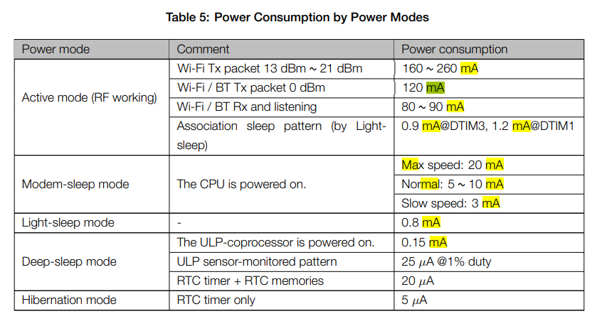

# ESP32のスリープモードについて

## ESP32のスリープモード
ESP32には、消費電力を抑えるための「スリープモード」が、大きく3種類存在します。
- Modem-sleep mode ：CPUの動作を維持したまま、非通信時にWiFi用のRF回路をオフにして電力をおさえる。WiFiとの接続は維持。
- Ligth-sleep mode : 通信が行われないときにはWiFi用のRF回路をオフにし、CPUの実行をサスペンド。GPIOなどの入力情報をトリガーに何かを実行するのに向いている。
- Deep-sleep mode : RTCのみの電源がオンでCPUは停止状態。復旧時に再起動されて、setup()から実行される。一定間隔(タイマー)で何かを実行するのに向いている。

## 電力消費仕様
上記の消費電力は、公式[データシート](http://akizukidenshi.com/download/ds/espressifsystems/esp_wroom_32_datasheet_en.pdf)の、以下の章に記載されています。

ポイントを要約すると、通常(『Active mode』)では **100mA** 前後消費(WifiやBLE状況の使用状況に依存)する電力を、『Light-sleep mode』で動作させた場合は **0.8mA(125分の1)**、『Deep-sleep mode』で動作させた場合は **0.15mA(666分の1)** まで下げることができる、ということ。

## サンプルソース

ここで照会するサンプルでは、GPIO33番にリードスイッチのOUTを読み込んでいる。ESP32は起動直後にLightSleepモードに入る。リードスイッチに磁石を近づけるとリードスイッチがONされ、LEDが点灯されるとともに（GPIO33番に信号がHIGHとなることで）ESP32がスリープ状態から復帰する。磁石を離してリードスイッチがOFFとなると、信号がLOW状態となり、再度LightSleepモードに移行する。

#### 配線図 

