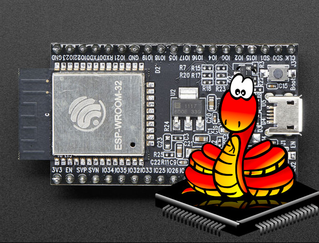
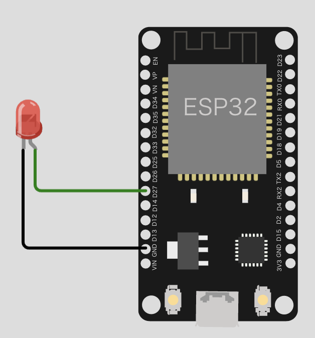

# ESP32へのMicroPython導入

ESP32でMicroPythonを使用するためには、ESP32のファームウェアの書き換えが必要となります。以下に、書き換えの手順と、書き換え後のPG操作方法を示します。



## 前提条件
- ローカル環境でPython(Ver3)が使用できる必要があります。

<br>

## 公式ドキュメント
[MicroPython ESP32 用クイックリファレンス](https://micropython-docs-ja.readthedocs.io/ja/latest/esp32/quickref.html)

<br>

## ESP32セットアップ

### esptoolのインストール

- pipコマンドでesptoolをインストールする  
  【参考】esptoolのGitHubの管理場所は[こちら](https://github.com/espressif/esptool)
``` bash
pip3 install esptool
```

### ESP32デバイスのIDを取得する
後述の手順では、ESP32デバイスのIDを指定する必要があります。ESP32をUSBに接続した状態で、以下のコマンドを実行することにより、デバイスIDを取得することができます。

Windowsの場合
```
# （要調査）
```

Macの場合
``` bash
$ ls /dev/tty.*
:
:
/dev/tty.wchusbserial53100042761   # ex.ESP32DeviceID
:
```

### ESP32のファームウェアを消去する
最初に、以下のコマンドで、ESP32のファームウェアを消去します。
``` bash
$ python3 esptool.py --port /dev/tty.wchu…(ESP32DeviceID) erase_flash
```

### ESP32にMicroPythonのファームウェアを書き込む

- [こちら](https://micropython.org/download/esp32/)のサイトからMicroPythonのファームウェアをダウンロードします。

- 以下のコマンドで、ESP32にファームウェアを書き込みます
```
$ Python3 esptool.py --chip esp32 --port /dev/tty.wchu…(ESP32DeviceID) write_flash -z 0x1000 esp32-20180(ファームウェアバイナリ).bin
```

### 動作確認
ターミナルから以下のコマンドを実行し、ESP32に接続を行います。
```
$ screen /dev/tty.wchu…(ESP32DeviceID) 115200
```
真っ黒な画面が表示された場合は、次の通り入力してください。
```
:> (Enter)
```
問題なければ、入力欄にプロンプト「`>>>`」が表示されます。下図の通り、LEDを接続して、以下のPythonコードを入力して動作確認を行います。



サンプルコード
``` Python
from machine import Pin
import time

led_pin = Pin(27 ,Pin.OUT)

While True:
    led_pin.on()
    time.sleep(1)
    led_pin.off()
    time.sleep(1)
```

１秒おきにLEDが点滅すれば、動作確認はOKとなります。

<br>

## 操作方法
MicroPythonでは、ESP32上にファイルを配置してプログラムを動かします。  
最初は、以下の通りルートに「boot.py」ファイルだけが配置されています。
```
$
/boot.py
```
ここに「main.py」を配置することにより、起動時に「main.py」に書かれた内容が実行されるようになります。

最初に、ファイル操作をするためのPythonプログラム「ampy」をインストールします。

``` bash
# ampy をインストールする
pip3 install adafruit-ampy 
```

インストールが完了したら、ファイル一覧を確認します。

``` bash
# ファイル一覧を取得する
$ ampy -p /dev/tty.wchu…(ESP32DeviceID) ls
```

ローカルで「main.py」として、前述のPGを記載してファイルを作成した後、以下のコマンドで、ESP32にファイルを転送します。

``` bash
# ESP32のファイル内容を参照する(ex /boot.py)
$ ampy -p /dev/tty.wchu…(ESP32DeviceID) get /boot.py
```

ESP32に電源を入れ直し、前述の動作確認と同じようにLEDが点滅することを確認してください。  

<br>
ampyには、上記以外に以下のようなコマンドがあります。色々試してみましょう。

``` bash
# ampyコマンドの実行シンタックス
$ ampy -p /dev/tty.wchu…(ESP32DeviceID) [Command] [option]
```

### ampy コマンド一覧

- get: ボードからPCにファイルを転送する
- ls: ボード上でlsを実行する
- mkdir: ボード上でmkdirを実行する
- put: PCからボードにファイルを転送する
- reset: ボードでソフトリセットとブートを実行する
- rm: ボード上でrmを実行する
- rmdir: ボード上でrmdirを実行する
- run: ボード上でプログラムファイルを実行する


``` bash
# ESP32にファイルを配置する(ex main.py)
$ ampy -p /dev/tty.wchu…(ESP32DeviceID) put main.py
```


## ESP32 初期出荷状態への戻し方
- 書き込みツール「[Flash Download Tools](https://docs.espressif.com/projects/esp-at/en/latest/esp32/Get_Started/Downloading_guide.html#download-at-firmware)」をダウンロードする。

- バイナリデータを、[espressif.comのサイト](https://docs.espressif.com/projects/esp-at/en/latest/esp32/AT_Binary_Lists/ESP32_AT_binaries.html) からダウンロードして使用する。


